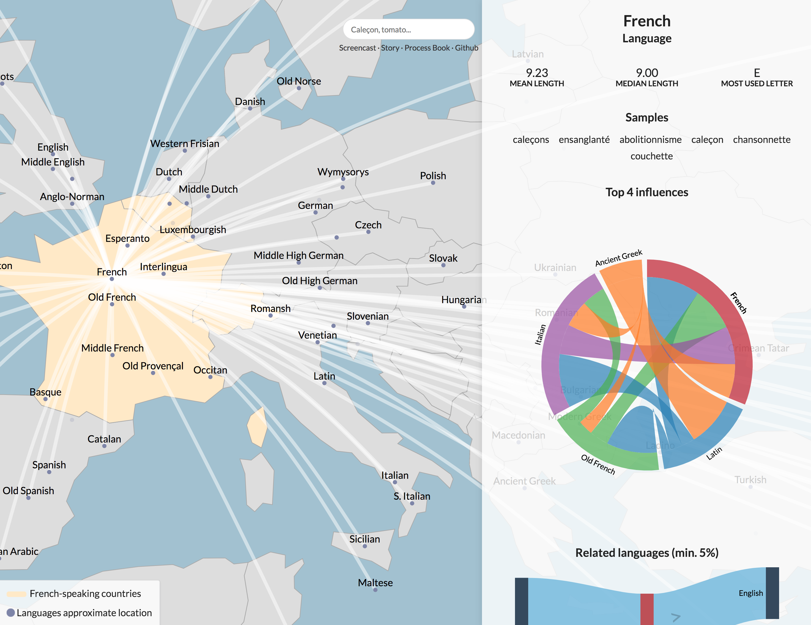

# Etymap

## Live version

A live version is available on [etymap.xyz](https://etymap.xyz).

Watch the [screencast](https://www.youtube.com/watch?v=eECwmJ6InZc), read the [story](https://etymap.xyz/story) or discover the [process book](https://etymap.xyz/process-book).



## Getting started

Install Livereload [extension](http://livereload.com/extensions/) and extract `data.7z`.

```shell
pip3 install -r requirements.txt
yarn
yarn start dev
# or
yarn start prod
```

The development flavour is available on [localhost:5000](http://localhost:5000).

## Build with

- Jupyter, http://jupyter.org/
- Flask, http://flask.pocoo.org/
- D3 Data-Driven Documents, https://d3js.org/
- Semantic UI, https://semantic-ui.com/
- Lodash, https://lodash.com/
- Jquery, https://jquery.org/
- Navigo, https://github.com/krasimir/navigo

## References

- Mledoze, Countries, https://github.com/mledoze/countries
- Gerard de Melo, Etymological Wordnet: Tracing the History of Words, 2014, http://www1.icsi.berkeley.edu/~demelo/etymwn
- Glottolog, Languages coordinates, http://glottolog.org
- SIL ISO 639-3, Macrolanguage mappings, www.sil.org/iso639-3
- Yago-Naga, UWN / MENTA: Towards a Universal Multilingual Wordnet, https://www.mpi-inf.mpg.de/departments/databases-and-information-systems/research/yago-naga/uwn/
- Dave Liepmann, Tufte CSS, https://edwardtufte.github.io/tufte-css/

## License

The project is licensed under MIT. Datasets follow their respective licensing schemes and are not be assimilated to the processing.
